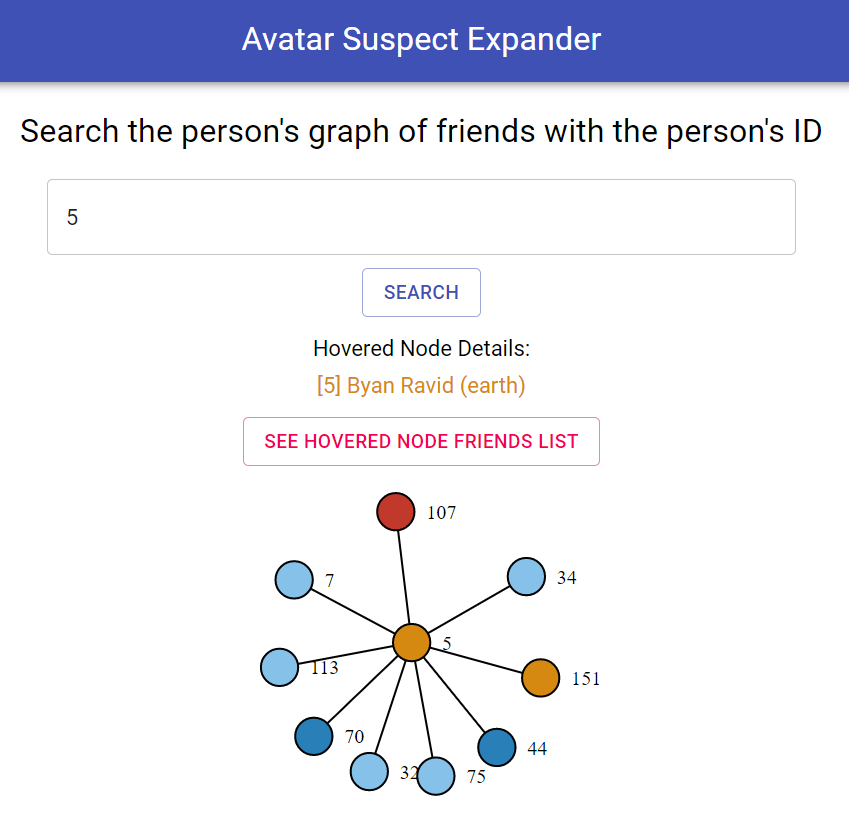
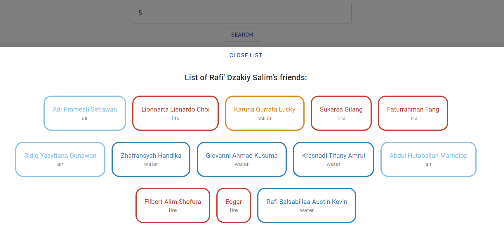

# Second Test Selection - Programming Laboratory
## Avatar Suspect Expander Application

**Avatar Suspect Expander Application** is a web application created using *React* that lets you search a person's relationship depicted with a graph. It is useful particularly for Wangky and his friend Toph. This web application is made by Muhammad Hasan (1358012).


## Running The Application

You can run this application by simply going to this webpage [Avatar Suspect Expander App](https://muhammadhasan01.github.io/AvatarSuspectExpander/), or you could follow this instructions if you want to run it in your localhost.

### Prerequisites

To get the website started you need to install **npm**, get npm [here](https://www.npmjs.com/get-npm). Make sure it is installed on your machine by

```
npm -v
```

### Installing

Get the development environment running by first cloning this repo,

```
git clone git@github.com:muhammadhasan01/AvatarSuspectExpander.git
```

then go to the directory,

```
cd avatar-suspect-expander
```
then install the packages.
```
npm install
```
Run it with
```
npm start
```
You should get a website running in <http://localhost:3000>

## Using The Application

To start, you need to type in the id person on the search bar, and then clicking the search button.

If the ID cannot be found, then it will display an error shown in this image:


If the ID is succesfully found, then it will display a graph, depicting the person's relationship.


You can then hover on a node to see it's detail such as ID, name, and the element.



You can also click on a node to see his/her friend's list.




## API Review

The API used in this application can be accesed at <https://avatar.labpro.dev>. The available Endpoint is `GET/friends/[id]`, this gives us the id's info and also the id's friends informations. Here is an example:


According to my analysis, this API gives us a valid tuple of (ID, name, element), what this means is there is no data in which it has the same ID, but different value of name and element. Apart from that, this API has a vulnerability, that is some of the ID's friends has a duplicated entry. For an example the `ID = 160` has a duplicate entry in it's friend list which is `ID = 101` and `ID = 174`. This is why when getting the data from the API, I need to make it unique first so that when I make the resulting graph and friend list, it shows only one entry.

## Library Used

- [react](https://reactjs.org/) - The framework used
- [npm](https://www.npmjs.com/)
- [material-ui](https://material-ui.com/)
- [axios](https://www.npmjs.com/package/axios)
- [react-d3-graph](https://www.npmjs.com/package/react-d3-graph)
